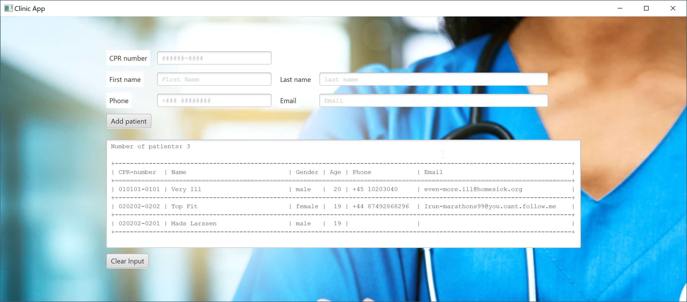
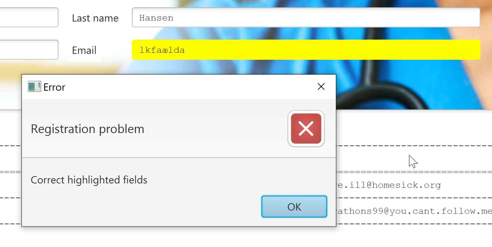

# Week 5 solutions

Programming Exercises

The exercise follows here:

1. A Patient class
Create a class for managing patients ie. the Patient class, with the following private attributes:

- first name
- last name
- CPR number (bonus: how do you ensure that the CPR is written correctly?)
- telephone number (bonus: how do you ensure that this is a valid telephone number?)
- E-mail (bonus: how do you ensure that this is a valid email address?)

Add the following public get- and set-methods: (In IntelliJ IDEA you can use Alt-insert and get the Generate menu that helps you) 

- getFirstname()
- setFirstName(newName)
- getLastName()
- setLastName()
- getCPR()
- setCPR(newCPR)
- getPhoneNumber()
- setPhoneNumber(newPhoneNumber)
- getEmail()
- setEmail(newEmail)
- getAge() - (this attribute is calculated from the CPR number, so there are no setter for this, and no private attribute)

2. Write a main method that exhibits the correct functioning of the patient class (create new patients, retrieve data from the patients, modify attributes of a patient, etc).
3. Create a graphical user interface (GUI) for the patient class in task 1
4. Create an Employee class that represents an employee at the health clinic. An employee has the following attributes 
- First name
- Last name
- Employee id eg mb001 and mb002
- Job description eg doctor, nurse, secretary, physical therapist, chiropractor, smoking cessation consultant or psychologist
- Scheduled days off


**Note that The solution will be presented in the order 1,4,2,3**

## Re 1

The patient class was defined in an earlier week's exercise. We just need to add email and some getters and setters.. (The trivial ones can be created using the Generate (Alt-Insert) menu.

So you will need to create a new JavaFX project (we already covered how to ) and - provided you already have created a patient class - copy the patient class into the new project. 

An example of the **Patient** class can be seen here:

```java
package sample;

import java.time.LocalDate;
import java.time.Period;
import java.time.format.DateTimeFormatter;


public class Patient {

    private String firstName;
    private String lastName;
    private String phoneNumber;
    private String email;
    private String cpr;

    public Patient(String firstName, String lastName, String inputCPR) {
        // assign the inputName to the field storing the patient's name. (replace the ??? with the field your created earlier)
        this.firstName = firstName;
        this.lastName = lastName;

        // assign the inputCPR to the field storing the patient's CPR-number. (replace the ??? with the field your created earlier)
        this.cpr = inputCPR;
    }

    public String getFirstName() {
        return firstName;
    }

    public void setFirstName(String firstName) {
        this.firstName = firstName;
    }

    public String getLastName() {
        return lastName;
    }

    public void setLastName(String lastName) {
        this.lastName = lastName;
    }

    public String getPhoneNumber() {
        return phoneNumber;
    }

    public void setPhoneNumber(String phoneNumber) {
        this.phoneNumber = phoneNumber;
    }

    public String getEmail() {
        return email;
    }

    public void setEmail(String email) {
        this.email = email;
    }

    public String getCpr() {
        return cpr;
    }

    public void setCpr(String cpr) {
        this.cpr = cpr;
    }

    public int getAge () {
        DateTimeFormatter dateFormatter = DateTimeFormatter.ofPattern("ddMMuu");
        LocalDate today = LocalDate.now();
        LocalDate birthdate = LocalDate.parse(cpr.substring(0,6), dateFormatter);
        // If the birthdate is after today, it's probably in the 1900's. Subtract 100 years.
        if (birthdate.isAfter(today)) { birthdate = birthdate.minusYears(100); }
        int age = Period.between(birthdate, today).getYears();
        return age;
    }
    public String getGender() {
        String serial = cpr.substring(7,11);
        if (Integer.parseInt(serial) % 2 == 0) {
            return "female";
        } else {
            return "male";
        }
    }

    @Override
    public String toString() {
        return "Patient{" +
                "firstName='" + firstName + '\'' +
                ", lastName='" + lastName + '\'' +
                ", phoneNumber='" + phoneNumber + '\'' +
                ", email='" + email + '\'' +
                ", cpr='" + cpr + '\'' +
                '}';
    }
}
``` 

## Re 4

To solve task 4 I have actually created two classes **Holidays** and **Employee** as I could then reuse some of the functionality from the previous week's exercises:

The **Holidays** class can be seen here - explanations are in the code comments.

```java
package sample;

import java.time.LocalDate;
import java.util.ArrayList;

public class Holidays {
    private ArrayList<LocalDate> holidays;

    public Holidays() {
        // The constructor
        this.holidays = new ArrayList<LocalDate>();
    }
    public void addHoliday(LocalDate holiday) {
        // add a holiday to the list of holidays - only if it is not in the list already
        if (! this.holidays.contains(holiday)) {this.holidays.add(holiday);}
    }
    public void removeHoliday(LocalDate holiday) {
        // remove a holiday from the list of holidays - only if it is in the list already
        if (this.holidays.contains(holiday)) {this.holidays.remove(holiday);}
    }

    public ArrayList<LocalDate> getHolidays() { // return a list of holidays
        return holidays;
    }

    public Boolean containsDay(LocalDate holiday) { // Check of the date in in the list of holidays

        return this.holidays.contains(holiday);
    }

    public void printHolidays() {
        System.out.println("Number of holidays: " + this.holidays.size());
            for (LocalDate d : this.holidays) {
                System.out.println(d);
        }

    }

    public Integer getSize() { // Return the number of holidays in the holidays list
        return this.holidays.size();
    }
}
```

Now we are ready to copy the employee class into the project:


```java
package sample;
import java.time.LocalDate;
import java.time.format.DateTimeFormatter;


public class Employee {
    private String firstName;
    private String lastName;
    private String employeeId;
    private Holidays holidays;

    public Holidays getHolidays() {
        return holidays;
    }

    public void setHolidays(Holidays holidays) {
        this.holidays = holidays;
    }


    public Employee(String firstName, String lastName, String employeeId) {
        this.firstName = firstName;
        this.lastName = lastName;
        this.employeeId = employeeId;

    }

    public String checkAvailable(Clinic clinic, LocalDate bookingDate){
        String bookingDateAsString=bookingDate.format(DateTimeFormatter.ofPattern("dd/MM/yyyy"));
        if (clinic.getHolidays().containsDay(bookingDate)) {
            return ("The clinic is closed on " +  bookingDateAsString);
        } else if (!(this.holidays==null) && this.holidays.containsDay(bookingDate)) {
            return("Employee is on holiday on " + bookingDateAsString);
        } else {
            return("Employee is available on " + bookingDateAsString);
        }
    };

    public void printHolidays() {
        if (this.holidays != null) {
            System.out.println("Number of holidays: " + this.holidays.getSize());
            if (this.holidays.getSize() > 0) {
                for (LocalDate d : this.holidays.getHolidays()) {
                    System.out.println(d);
                }
            }
        }
    }

}
```

The **Employee** class also contains references to the **Clinic** class (we used it - in a quick and dirty solution - in order to check available holidays for an employee in a clinic) - and why not keep it here, so let us also add the **Clinic** class. (Alternatively you must remove all references for the code to work):

```java
package sample;

public class Clinic {
    // Class to hold a clinic and the associated holidays

    private Integer clinicNumber;
    private Holidays holidays;
    public Clinic(Integer clinicNumber, Holidays inputHolidays) {
        this.clinicNumber = clinicNumber;
        this.holidays = inputHolidays;
    }

    public Holidays getHolidays() {
        return holidays;
    }

    public void setHolidays(Holidays holidays) {
        this.holidays = holidays;
    }
}
```

## Re 2

To solve this task I will also need the **PatientRegister** class from week 2 which can generate a list of patients and add to and remove patients.
I have introduced a method to print all patients as a nicely formatted table (at least if you use a monospaced font) by using a string formatter.
Furthermore the **addPatient()** method now throws an exception if you try to add a patient to the Register with a CPR-number that already belongs to a patient.
We can catch this exception in the GUI in task 3 in order to be able to display some useful messages to the user.

```java
package sample;

import java.util.ArrayList;

public class PatientRegister {
    // An arraylist that will hold the registered patients
        public ArrayList<Patient> patients;
    // Constructor - EXPLAIN
    public PatientRegister() {
        this.patients = new ArrayList<Patient>();
    }
    // The method should check if the patient already exists in the patients-list. If not, the patient should be added to the list.
    public void addPatient(Patient patient) throws Exception{
        // fill in code here
        Boolean contains = false;
        for (Patient patient1 : patients) {
            if (patient1.getCpr().equals(patient.getCpr())) {
                contains = true;
            };

        }

        if (! contains) {
            this.patients.add(patient);
        } else {
            throw new Exception("Already in list");
        }
    }
    // The method should remove the patientToRemove from the patients list.
    public void removePatient(Patient patient) {
        if (this.patients.contains(patient)) {this.patients.remove(patient);}
        // fill in code here
    }
    // The method should first print the current number of patients in the patients-list.
    // Then loop through the patients in the patients-list,
    // and print out their name and cpr.
    public void printPatients() {
        // Fill in code here
        System.out.println("Number of patients: " + this.patients.size());
        for (Patient p : this.patients) {
            System.out.println("Name:" + p.getFirstName() +" "+ p.getLastName() + " - "+
                    "CPR-number: " + p.getCpr() + " - " +
                    "Gender: " + p.getGender() +" - " +
                    "Age: " + p.getAge());
        }
    }

    public String listPatients() {
        // Fill in code here
        String returnString;
        returnString="Number of patients: " + this.patients.size() +"\n\n";
        returnString+="+-------------+--------------------------------+--------+-----+------------------+----------------------------------------+\n";
        returnString+="| CPR-number  | Name                           | Gender | Age | Phone            | Email                                  |\n";
        returnString+="+=============+================================+========+=====+==================+========================================+\n";

        for (Patient p : this.patients) {
            String fullName = p.getFirstName()+" "+p.getLastName();
            //String newLine = String.format("CPR-number: %11s  Name: %-30s  Gender: %6s  Age: %3d  Phone: %16s  Email: %s\n",
            //        p.getCpr(),fullName,p.getGender(),p.getAge(),p.getPhoneNumber(),p.getEmail());
            String newLine = String.format("| %11s | %-30s | %-6s | %3d | %-16s | %-38s |\n",
                    p.getCpr(),fullName,p.getGender(),p.getAge(),p.getPhoneNumber(),p.getEmail());
                    returnString += newLine;
                    returnString+="+-------------------------------------------------------------------------------------------------------------------------+\n";


        }
        return returnString;
    }

    @Override
    public String toString() {
        return "PatientRegister{" +
                "patients=" + patients +
                '}';
    }
}
```

Now can add the lines in the main method that introduce som test objects and manipulates those objects.
The full main method will be shown a little later in the solution to task 3.


```java
 // initialize some test data
        LocalDate d1 = LocalDate.of(2021,2,22);
        LocalDate d2 = LocalDate.of(2021,2,23);
        LocalDate d3 = LocalDate.of(2021,2,23);
        LocalDate d4 = LocalDate.of(2021,2,24);

        Holidays emp1Holidays = new Holidays();
        Holidays clinicHolidays = new Holidays();

        emp1Holidays.addHoliday(d1);
        emp1Holidays.addHoliday(d2);
        emp1Holidays.addHoliday(d3);
        emp1Holidays.addHoliday(d4);

        Employee emp1 = new Employee("Hans", "Nielsen","mbe001");
        emp1.setHolidays(emp1Holidays);
        System.out.println("Employee holidays:");
        emp1.printHolidays();

        clinicHolidays.addHoliday(d1);
        clinicHolidays.addHoliday(d2);
        clinicHolidays.removeHoliday(d3);
        clinicHolidays.addHoliday(d4);
        Clinic clinic1 = new Clinic(21,clinicHolidays);

        System.out.println("Clinic holidays:");
        clinic1.getHolidays().printHolidays();

        //Emulating Booking Attempt on the console
        LocalDate bookingDate= LocalDate.of(2021,2,23);
        System.out.println("Attempt: Booking employee on "+ bookingDate);
        System.out.println(emp1.checkAvailable(clinic1,bookingDate));

        bookingDate= LocalDate.of(2021,2,24);
        System.out.println("Attempt: Booking employee on "+ bookingDate);
        System.out.println(emp1.checkAvailable(clinic1,bookingDate));

        bookingDate= LocalDate.of(2021,2,19);
        System.out.println("Attempt: Booking employee on "+ bookingDate);
        System.out.println(emp1.checkAvailable(clinic1,bookingDate));

        Patient p1 = new Patient("Very","Ill","010101-0101");
        Patient p2 = new Patient("Top","Fit","020202-0202");
        p1.setPhoneNumber("+45 10203040");
        p1.setEmail("very.ill@homesick.org");

        System.out.println(p1);

        // Change p1's email
        p1.setEmail("even-more.ill@homesick.org");

        System.out.println("email changed\n"+p1);

        // Set som more attributes for p2;
        p2.setPhoneNumber("+44 87492868296");
        p2.setEmail("Irun-marathons99@you.cant.follow.me");

        System.out.println(p2);

        PatientRegister patientRegister = new PatientRegister();
        try {
            patientRegister.addPatient(p1);
        } catch (Exception e) {
            e.printStackTrace();
            //System.out.println(e);
        }
        try {
            patientRegister.addPatient(p2);
        } catch (Exception e) {
            e.printStackTrace();
            //System.out.println(e);
        }


        patientRegister.printPatients();
        System.out.println(patientRegister);

```

## Re 3

Now we are almost ready to create a GUI i JavaFX for adding patients to the patients class. However when users are entering data in a form, errors can happen.
The **DataValidator** to the rescue! it will validate if the CPR number is in the right format (#######-####), validate if the email is i the right format (This turns out to be a very difficult task - I have included a regex which seams to take pretty good care of validating the most valid email adresses) and validate if the name is valid (simple check if it containts letters. This will fail on names like Marie-Louise and hence must be enhanced to allow for such double names if e.g. used for production). Finally I have introduced a phone number validater which worhs if the phone number is prefix with the country code.

We are now ready to create a GUI like:



The Gui is made with a gridpane, labels, textfields (for input) and a textarea which is updated everytime a patient is registered.
I have used the **DataValidator** class to check the users input and used css styling to color the imput fields which contains invalid input.


Last but not least I have introduced three useful methods: **capitalize()** can correct som user typos like "jaKob" to "Jakob". **clearTextFields()** takes a gridpane object as input and clears the context and eventual style (yellow background) of all textfields belonging to that gridpane. Finally **resetTextFields()** which will clear the content of all textfields that have a style set (and leave the textfields which do not have a style). This is useful so that the user will not have to retype already validated input.

Try to play with the GUI in order to understand the code - maybe there is something you can use in your project or at least act as inspiration :smiley:

Here is the full **Main** class containing the **main()** method:

```java
package sample;

import javafx.application.Application;
import javafx.scene.Node;
import javafx.scene.Scene;
import javafx.scene.control.*;
import javafx.scene.text.Font;
import javafx.stage.Stage;
import javafx.scene.layout.GridPane;
import javafx.geometry.Pos;

import java.time.LocalDate;

public class Main extends Application {

    @Override
    public void start(Stage primaryStage) {     // a Stage is the main window for a JavaFX application
        // initialize some test data
        LocalDate d1 = LocalDate.of(2021,2,22);
        LocalDate d2 = LocalDate.of(2021,2,23);
        LocalDate d3 = LocalDate.of(2021,2,23);
        LocalDate d4 = LocalDate.of(2021,2,24);

        Holidays emp1Holidays = new Holidays();
        Holidays clinicHolidays = new Holidays();

        emp1Holidays.addHoliday(d1);
        emp1Holidays.addHoliday(d2);
        emp1Holidays.addHoliday(d3);
        emp1Holidays.addHoliday(d4);

        Employee emp1 = new Employee("Hans", "Nielsen","mbe001");
        emp1.setHolidays(emp1Holidays);
        System.out.println("Employee holidays:");
        emp1.printHolidays();

        clinicHolidays.addHoliday(d1);
        clinicHolidays.addHoliday(d2);
        clinicHolidays.removeHoliday(d3);
        clinicHolidays.addHoliday(d4);
        Clinic clinic1 = new Clinic(21,clinicHolidays);

        System.out.println("Clinic holidays:");
        clinic1.getHolidays().printHolidays();

        //Emulating Booking Attempt on the console
        LocalDate bookingDate= LocalDate.of(2021,2,23);
        System.out.println("Attempt: Booking employee on "+ bookingDate);
        System.out.println(emp1.checkAvailable(clinic1,bookingDate));

        bookingDate= LocalDate.of(2021,2,24);
        System.out.println("Attempt: Booking employee on "+ bookingDate);
        System.out.println(emp1.checkAvailable(clinic1,bookingDate));

        bookingDate= LocalDate.of(2021,2,19);
        System.out.println("Attempt: Booking employee on "+ bookingDate);
        System.out.println(emp1.checkAvailable(clinic1,bookingDate));

        Patient p1 = new Patient("Very","Ill","010101-0101");
        Patient p2 = new Patient("Top","Fit","020202-0202");
        p1.setPhoneNumber("+45 10203040");
        p1.setEmail("very.ill@homesick.org");

        System.out.println(p1);

        // Change p1's email
        p1.setEmail("even-more.ill@homesick.org");

        System.out.println("email changed\n"+p1);

        // Set som more attributes for p2;
        p2.setPhoneNumber("+44 87492868296");
        p2.setEmail("Irun-marathons99@you.cant.follow.me");

        System.out.println(p2);

        PatientRegister patientRegister = new PatientRegister();
        try {
            patientRegister.addPatient(p1);
        } catch (Exception e) {
            e.printStackTrace();
            //System.out.println(e);
        }
        try {
            patientRegister.addPatient(p2);
        } catch (Exception e) {
            e.printStackTrace();
            //System.out.println(e);
        }


        patientRegister.printPatients();
        System.out.println(patientRegister);


        // Finished initialization of test values
        // Now let us create a GUI!!

        // First set the stage and add a grid

        primaryStage.setTitle("Clinic App");   // set the title shown int th title bar
        GridPane grid = new GridPane();         // create a GridPane for a nice even flexible screen layout
        grid.setAlignment(Pos.CENTER);          // Align the grid to the center of the application window
        grid.setHgap(10);                       // set the horizontal gap between the fields to 10 pixels
        grid.setVgap(10);                       // set the vertical gap between the fields to 10 pixels
        //grid.setGridLinesVisible(true);       // uncomment if you want to check the grid layout


        // Now create some labels and input fields

        Label cprLabel = new Label("CPR number");      // create a label displaying "CPR number"
        TextField cprText = new TextField();

        cprText.setPromptText("######-####");

        Label firstNameLabel = new Label("First name");
        TextField firstNameText = new TextField();
        firstNameText.setPrefWidth(200);
        firstNameText.setPromptText("First Name");


        Label lastNameLabel = new Label("Last name");
        TextField lastNameText = new TextField();


        lastNameText.setMaxWidth(400);                  // add som more space for the last name
        lastNameText.setPromptText("last name");

        Label phoneLabel = new Label("Phone");
        TextField phoneText = new TextField();
        phoneText.setPrefWidth(200);
        phoneText.setPromptText("+### ########");

        Label emailLabel = new Label("Email");
        TextField emailText = new TextField();
        emailText.setMaxWidth(400);                     // add som more space for the email
        emailText.setPromptText("Email");

        // Create a TextArea to hold the view of the patients list.
        // for now we use the listPatients method which uses string formatter to get a decent layout
        // In later exercises we will go for table view
        TextArea patientListTextArea = new TextArea();
        patientListTextArea.setPromptText("Do nit be alarmed!\rThis massage is made bu a machine");
        patientListTextArea.setPrefHeight(190);         // set the preferable height of the patient list
        patientListTextArea.setPrefWidth(830);          // set the preferable width of the patient list
        patientListTextArea.setEditable(false);         // make sure the user can't edit the patient list field
        patientListTextArea.setFont(Font.font ("Courier New", 11)); // set a monospaced font


        patientListTextArea.setText(patientRegister.listPatients());

        Button buttonAdd = new Button("Add patient");       // create a clickable button to add a patient
        Button buttonClearAll = new Button("Clear Input");    // create another clickable button to clear input fields

        // now create an event handler which will be called when the "Add" button is clicked
        buttonAdd.setOnMouseClicked(event -> {
            String cprInput= cprText.getText();
            String firstNameInput= capitalize(firstNameText.getText());
            String lastNameInput= capitalize(lastNameText.getText());
            String phoneInput = phoneText.getText();
            String emailInput = emailText.getText();
            boolean validInput= true;

            // validate the user input

            if (!DataValidator.isValidCPR(cprInput)){
                // we need a CPR number in order to register a user
                // highlight the CPR input field if content is invalid
                cprText.setStyle("-fx-background-color: yellow");
                validInput = false;
            }
            if (!emailInput.isEmpty() && ! DataValidator.isValidEmail(emailInput)){
                // email is optional - but if it is there it needs to be valid
                emailText.setStyle("-fx-background-color: yellow");
                validInput = false;
            }

            if (!phoneInput.isEmpty()  && ! DataValidator.isValidPhone(phoneInput)){
                // phone is optional - but if it is there it needs to be valid
                phoneText.setStyle("-fx-background-color: yellow");
            }

            if (firstNameInput.isEmpty() || ! DataValidator.isValidName(firstNameInput)){
                // We need a valid first name
                firstNameText.setStyle("-fx-background-color: yellow");
                validInput = false;
            }

            if (lastNameInput.isEmpty() || ! DataValidator.isValidName(lastNameInput)){
                // We need a valid last name
                lastNameText.setStyle("-fx-background-color: yellow");
                validInput = false;
            }

            // Now register the patient in the patient register
            // alert the user if the patient is already there

            if (validInput) {
                Patient p = new Patient(firstNameInput,lastNameInput,cprInput);
                p.setPhoneNumber(phoneInput);
                p.setEmail(emailInput);
                try {
                    patientRegister.addPatient(p);
                    clearTextFields(grid);
                    resetTextFields(grid);
                } catch (Exception e) {

                    // The patient is already there
                    e.printStackTrace();

                    cprText.setStyle("-fx-background-color: yellow");
                    Alert alert = new Alert(Alert.AlertType.ERROR);
                    //alert.setTitle("Error Dialog");
                    alert.setHeaderText("Registration problem");
                    alert.setContentText("CPR-number " + cprInput +" already found in register");

                    alert.showAndWait();
                }

            } else {
                // Something is wrong in one or more input fields
                // Tell the user to correct input

                Alert alert = new Alert(Alert.AlertType.ERROR);
                //alert.setTitle("Error Dialog");
                alert.setHeaderText("Registration problem");
                alert.setContentText("Correct highlighted fields");

                alert.showAndWait();
                resetTextFields(grid);
            }
            // list the patients
            patientListTextArea.setText(patientRegister.listPatients());

        });

        buttonClearAll.setOnMouseClicked(mouseEvent -> clearTextFields(grid));

        // Now place all the fields in the grid
        // maybe VBox and HBox would be better suited.. next time :-)

        grid.add(cprLabel, 0, 0);
        grid.add(cprText, 1, 0);
        grid.add(firstNameLabel, 0, 1);
        grid.add(firstNameText, 1, 1);
        grid.add(lastNameLabel, 2, 1);
        grid.add(lastNameText, 3, 1);
        grid.add(phoneLabel,0,2);
        grid.add(phoneText, 1, 2);
        grid.add(emailLabel, 2, 2);
        grid.add(emailText, 3, 2);

        grid.add(buttonAdd, 0, 3);
        grid.add(patientListTextArea, 0, 5, 4,1);    // allow it to expand to 4 columns
        grid.add(buttonClearAll, 0, 6);


        // and while we are at it - set monospaced font for text fields too..

        for (Node node : grid.getChildren()) {
            if (node instanceof TextField) {
                ((TextField)node).setFont(Font.font ("Courier New", 11));
            }
        }

        for (Node node : grid.getChildren()) {
            if (node instanceof Label) {
                node.setStyle("-fx-border-color:white; -fx-background-color: white; -fx-padding:4px");
            }
        }


        Scene scene = new Scene(grid, 1200, 500); // create a scene window 1200 x 400 pixels
        grid.setStyle("-fx-background-image: " +
        //"url(\"https://previews.123rf.com/images/graphicbee/graphicbee1707/graphicbee170700093/83775192-male-general-practitioner-vector-illustration-of-a-smiling-doctor-or-family-practitioner-.jpg\"); -fx-background-radius: 10;"
        "url(\"https://media.gettyimages.com/photos/these-hands-will-take-care-of-you-picture-id855467380?s=2048x2048\")"
        );
        primaryStage.setScene(scene);                   // add the scene to the stage / application window
        primaryStage.show();                 // display the stage - important! otherwise nothing happens :-)
    }

    private void clearTextFields(GridPane grid) {
        // Simple method to clear the text fields in a grid
        for (Node node : grid.getChildren()) {
            if (node instanceof TextField) {
                // clear
                ((TextField)node).setText("");
                node.setStyle(null);
            }
        }
    }

    private void resetTextFields(GridPane grid) {
        // Simple method to reset the style on text fields in a grid which have a style set
        // and don't touch the other fields
        // We use it to clear the fields we turned yellow
        for (Node node : grid.getChildren()) {
            if (node instanceof TextField) {
                System.out.println(node.getStyle());
                // clear
                if (node.getStyle() != null && !node.getStyle().equals("")) {
                    ((TextField) node).setText("");
                    node.setStyle(null);
                }
            }
        }
    }
    public static String capitalize(String str) {
        // Method to make names appear with capital first letter
        // also turn uppercase letters not in first position into lowercase
        // sorry McDonald!
        if(str == null || str.isEmpty()) {
            return str;
        }
        return str.substring(0, 1).toUpperCase() + str.substring(1).toLowerCase();
    }
    public static void main(String[] args) {
        launch(args);
    }

}

```

A zipfile containing all the java files above can be downloaded here [week5.zip](week5.zip). Not that the controller and fxml files are left out, as they are not used (yet).

