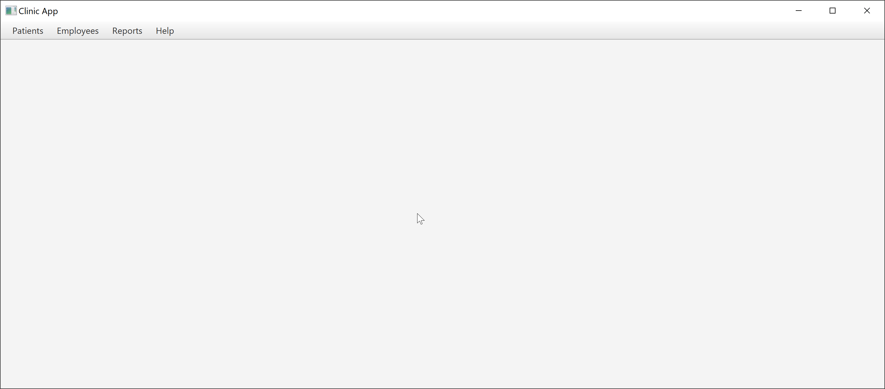
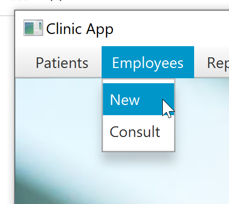
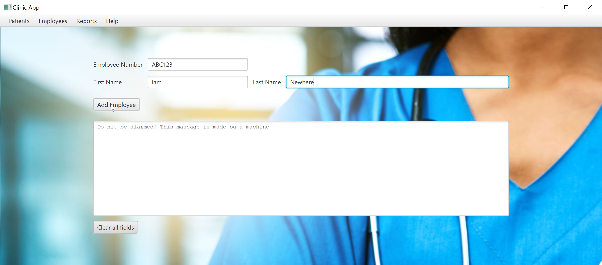
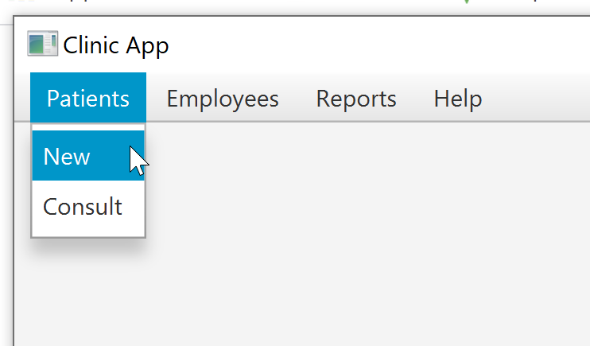
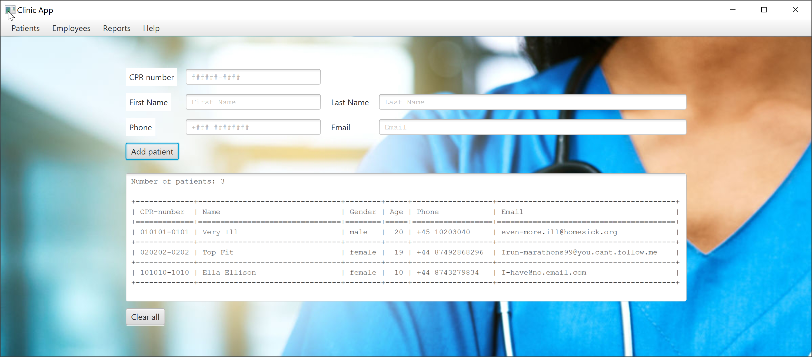

# Quick JavaFX Multi Scene Howto

This is a quick instruction in how you can create a JavaFX application with multiple controllers and multiple Scenes.
The scenes are swapped when menu items are clicked.

The application is roughly an extension to what we have created in the other exercises.
The classes have almost remained untouched - I think you can quickly find the changes if any.

The application will allow you to add (and list) new patients and to add an employee. Please notice that
their is no employee list - that is for you to create - if you haven't done so already. Maybe you can also add the holdidays part?

The main idea is to create a "main" controller and fxml file - here called MultiSceneController.java and Multiscene.fxml
I have created it using SceneBuilder and creating a new basic application from the templates.
Then I have removed (almost) all stuff I don't use.

The fxml file defines a basic menu and an empty anchor pane.
The idea is - depending on the context - to add and remove different grid panes to the anchor pane.

Each grid pane has it's own view part (fxml) and controller.

The switching is done in MultiSceneController by calling setGridPane method) (in Main) when a menu item is clicked.

You can easily yourself add the fxml and controller files for the "Consult" menu items.

A zip file of the src directory can be downloaded here: [multiscene.zip](multiscene.zip)

